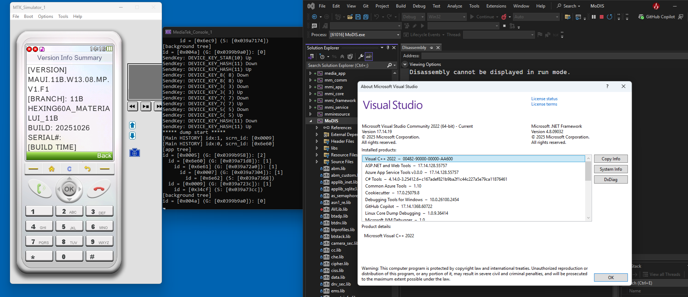

# MTK MODIS building under VS2022 patch

## EN

This is patch files to modify building tool for MODIS to support visualstudio 2022.

The changes done are: output project to vcxproj format, using msbuild to build MODIS from CMD

### Usage

1. Download the package, must copy the two folders (make, MoDIS_VC9) to the MAUI project path

2. Update MoDIS project by: "make <PROJECT> <TYPE> gen_modis"

## CN

这是用于修改MODIS构建工具以支持visualstudio 2022的补丁文件。

所做的更改包括：将项目输出为vcxproj格式，使用msbuild从CMD构建MODIS

### 使用方法

1. 下载该包后，必须将两个文件夹（make、MoDIS_VC9）复制到MAUI项目路径下

2. 更新MoDIS项目：执行命令 `make <PROJECT> <TYPE> gen_modis`
